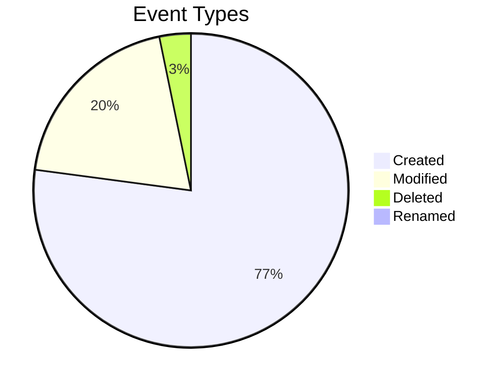

# 📊 Activity Dashboard

*Generated on 2/5/2026 at 8:01:48 AM*

> [!button] Refresh Dashboard
> ```command
> daily-activity: Refresh dashboard
> ```

This dashboard provides visualizations and insights from your Obsidian activity data. Advanced charts are rendered using the Charts plugin.

> [!NOTE]
> This dashboard is automatically generated by the Daily Activity plugin. Manual edits will be overwritten when the dashboard is updated.

> [!info] Activity Tracking Notice
> This dashboard is excluded from activity tracking. Any changes you make to this file will not affect your activity metrics.

---

# Activity Summary (Last 30 Days)

## Key Metrics

- **Total Events:** 26397
- **Unique Files:** 1678
- **Lines Added:** 5754840607
- **Lines Removed:** 107151566
- **Net Change:** 5647689041 lines

## Event Breakdown



## Activity Snapshot

| Metric | Value |
|--------|-------|
| Most Active Day | Friday |
| Most Active Hour | 17:00-18:00 |
| Most Edited File | [[MISSION CONTROL]] (653 edits) |
| Average Daily Events | 880 |
| Average Edits Per File | 3 |

---

# Top Files Analysis

## Top 10 Most Edited Files

| File | Edits | Lines Added | Lines Removed |
|------|-------|-------------|---------------|
| [[MISSION CONTROL]] | 653 | 7761210 | 4601905 |
| [[December 2025]] | 486 | 45438423 | 21764445 |
| [[obsiget example]] | 468 | 97471020 | 7309540 |
| [[take a peek into my universe (w.i.p.)]] | 449 | 2101429 | 359552 |
| [[HOME]] | 361 | 2668209 | 2337605 |
| [[2025-10-15]] | 306 | 2208871 | 19496 |
| [[README]] | 300 | 2253033 | 267107 |
| [[Daily New]] | 267 | 812535 | 375089 |
| [[December 2025 w Activities]] | 226 | 15464400 | 3396959 |
| [[Frequency Scanner]] | 198 | 13969340 | 3577161 |


## Top Files by Edit Count

```chart
type: bar
labels: ["MISSION CONTROL", "December 2025", "obsiget example", "take a peek int", "HOME"]
series:
  - title: Edits
    data: [653, 486, 468, 449, 361]
tension: 0.2
width: 80%
labelColors: true
beginAtZero: true
```


---

# Time Distribution

## Activity by Day of Week

```chart
type: bar
labels: ["Sun", "Mon", "Tue", "Wed", "Thu", "Fri", "Sat"]
series:
  - title: Events
    data: [5342, 338, 692, 4903, 3499, 6274, 5349]
width: 80%
labelColors: true
beginAtZero: true
```

## Activity by Hour of Day

```chart
type: bar
labels: ["00:00", "02:00", "04:00", "06:00", "08:00", "10:00", "12:00", "14:00", "16:00", "18:00", "20:00", "22:00"]
series:
  - title: Events
    data: [97, 22, 13, 27, 1594, 970, 5098, 1171, 4247, 6323, 3307, 3528]
width: 80%
labelColors: true
beginAtZero: true
```

## Insights

You are most active on Fridays and least active on Mondays

You are most active during the evening (6PM-12AM) and least active during the night (12AM-5AM)

---

# Activity Heatmap

```chart
type: polarArea
labels: ["Morning", "Afternoon", "Evening", "Night"]
series:
  - title: Sun
    data: [818, 2476, 2032, 16]
  - title: Mon
    data: [12, 224, 98, 4]
  - title: Tue
    data: [50, 288, 354, 0]
  - title: Wed
    data: [58, 1332, 3503, 10]
  - title: Thu
    data: [64, 875, 2556, 4]
  - title: Fri
    data: [1466, 3570, 1202, 36]
  - title: Sat
    data: [134, 1751, 3413, 51]
width: 70%
labelColors: true
```

### Activity by Time of Day

| Day | Morning (5-11) | Afternoon (12-17) | Evening (18-23) | Night (0-4) | Total |
|-----|---------------|------------------|----------------|------------|-------|
| Sunday | 818 | 2476 | 2032 | 16 | 5342 |
| Monday | 12 | 224 | 98 | 4 | 338 |
| Tuesday | 50 | 288 | 354 | 0 | 692 |
| Wednesday | 58 | 1332 | 3503 | 10 | 4903 |
| Thursday | 64 | 875 | 2556 | 4 | 3499 |
| Friday | 1466 | 3570 | 1202 | 36 | 6274 |
| Saturday | 134 | 1751 | 3413 | 51 | 5349 |


---

# Activity Trends

## Activity Over Time

```chart
type: line
labels: ["01-07", "01-10", "01-13", "01-16", "01-19", "01-22", "01-25", "01-28", "01-31", "02-03"]
series:
  - title: Total
    data: [3381, 330, 3875, 3529, 1856, 2664, 517, 2912, 5871, 1368]
  - title: Created
    data: [2948, 34, 3086, 3287, 1480, 1891, 18, 2581, 3696, 1248]
  - title: Modified
    data: [381, 287, 765, 239, 371, 756, 488, 311, 1374, 119]
tension: 0.2
width: 90%
fill: false
beginAtZero: true
```

## Event Type Distribution

```chart
type: pie
labels: ["Created", "Modified", "Deleted", "Renamed"]
series:
  - data: [20269, 5091, 847, 96]
width: 60%
labelColors: true
```

## Trend Analysis

- **Activity Trend:** Your activity has increased by 157% over the last month
- **Peak Activity:** Your most active day was 2026-02-01 with 4169 events
- **Consistency:** You have consistent daily activity in Obsidian

---

# Writing Patterns

## Content Changes

```chart
type: pie
labels: ["Small Edits (<10 lines)", "Medium Edits (10-49 lines)", "Large Edits (50+ lines)"]
series:
  - data: [8, 45, 5095]
width: 60%
labelColors: true
```

```chart
type: bar
labels: ["Lines Added", "Lines Removed"]
series:
  - data: [189494648, 34291081]
width: 50%
labelColors: true
beginAtZero: true
```

## Writing Style Analysis

- **Bulk Writer:** You often write large chunks of content at once, with significant additions.
- **Additive Writer:** You primarily add new content with minimal deletion of existing text.
- **Regular Contributor:** You edit your notes frequently, showing consistent engagement.


