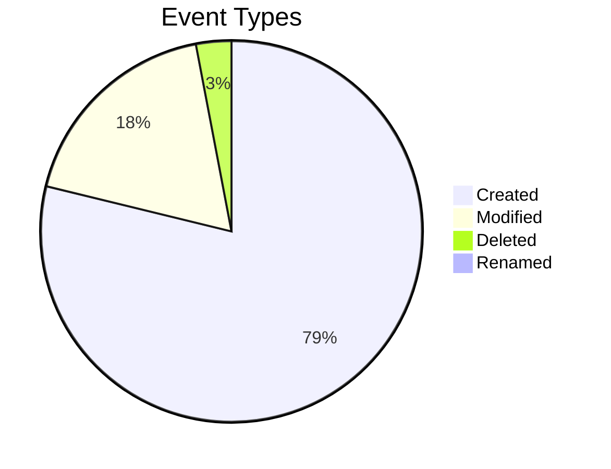

# 📊 Activity Dashboard

*Generated on 2/7/2026 at 10:29:36 AM*

> [!button] Refresh Dashboard
> ```command
> daily-activity: Refresh dashboard
> ```

This dashboard provides visualizations and insights from your Obsidian activity data. Advanced charts are rendered using the Charts plugin.

> [!NOTE]
> This dashboard is automatically generated by the Daily Activity plugin. Manual edits will be overwritten when the dashboard is updated.

> [!info] Activity Tracking Notice
> This dashboard is excluded from activity tracking. Any changes you make to this file will not affect your activity metrics.

---

# Activity Summary (Last 30 Days)

## Key Metrics

- **Total Events:** 28279
- **Unique Files:** 1673
- **Lines Added:** 6131356994
- **Lines Removed:** 106792005
- **Net Change:** 6024564989 lines

## Event Breakdown



## Activity Snapshot

| Metric | Value |
|--------|-------|
| Most Active Day | Friday |
| Most Active Hour | 17:00-18:00 |
| Most Edited File | [[MISSION CONTROL]] (656 edits) |
| Average Daily Events | 943 |
| Average Edits Per File | 3 |

---

# Top Files Analysis

## Top 10 Most Edited Files

| File | Edits | Lines Added | Lines Removed |
|------|-------|-------------|---------------|
| [[MISSION CONTROL]] | 656 | 7797516 | 4601905 |
| [[December 2025]] | 489 | 45499092 | 21764445 |
| [[obsiget example]] | 471 | 98063856 | 7309540 |
| [[take a peek into my universe (w.i.p.)]] | 449 | 2101429 | 359552 |
| [[HOME]] | 361 | 2668209 | 2337605 |
| [[2025-10-15]] | 309 | 2235487 | 19496 |
| [[README]] | 300 | 2253033 | 267107 |
| [[Daily New]] | 270 | 833013 | 375089 |
| [[December 2025 w Activities]] | 226 | 15464400 | 3396959 |
| [[2025-11-23]] | 198 | 1558909 | 13203 |


## Top Files by Edit Count

```chart
type: bar
labels: ["MISSION CONTROL", "December 2025", "obsiget example", "take a peek int", "HOME"]
series:
  - title: Edits
    data: [656, 489, 471, 449, 361]
tension: 0.2
width: 80%
labelColors: true
beginAtZero: true
```


---

# Time Distribution

## Activity by Day of Week

```chart
type: bar
labels: ["Sun", "Mon", "Tue", "Wed", "Thu", "Fri", "Sat"]
series:
  - title: Events
    data: [5342, 338, 598, 4163, 6142, 6317, 5379]
width: 80%
labelColors: true
beginAtZero: true
```

## Activity by Hour of Day

```chart
type: bar
labels: ["00:00", "02:00", "04:00", "06:00", "08:00", "10:00", "12:00", "14:00", "16:00", "18:00", "20:00", "22:00"]
series:
  - title: Events
    data: [97, 22, 13, 27, 1595, 974, 6832, 1140, 5125, 6311, 3286, 2857]
width: 80%
labelColors: true
beginAtZero: true
```

## Insights

You are most active on Fridays and least active on Mondays

You are most active during the afternoon (12PM-6PM) and least active during the night (12AM-5AM)

---

# Activity Heatmap

```chart
type: polarArea
labels: ["Morning", "Afternoon", "Evening", "Night"]
series:
  - title: Sun
    data: [818, 2476, 2032, 16]
  - title: Mon
    data: [12, 224, 98, 4]
  - title: Tue
    data: [25, 219, 354, 0]
  - title: Wed
    data: [58, 1298, 2797, 10]
  - title: Thu
    data: [64, 3516, 2558, 4]
  - title: Fri
    data: [1466, 3613, 1202, 36]
  - title: Sat
    data: [164, 1751, 3413, 51]
width: 70%
labelColors: true
```

### Activity by Time of Day

| Day | Morning (5-11) | Afternoon (12-17) | Evening (18-23) | Night (0-4) | Total |
|-----|---------------|------------------|----------------|------------|-------|
| Sunday | 818 | 2476 | 2032 | 16 | 5342 |
| Monday | 12 | 224 | 98 | 4 | 338 |
| Tuesday | 25 | 219 | 354 | 0 | 598 |
| Wednesday | 58 | 1298 | 2797 | 10 | 4163 |
| Thursday | 64 | 3516 | 2558 | 4 | 6142 |
| Friday | 1466 | 3613 | 1202 | 36 | 6317 |
| Saturday | 164 | 1751 | 3413 | 51 | 5379 |


---

# Activity Trends

## Activity Over Time

```chart
type: line
labels: ["01-09", "01-12", "01-15", "01-18", "01-21", "01-24", "01-27", "01-30", "02-02", "02-05"]
series:
  - title: Total
    data: [2756, 1464, 5240, 1109, 3275, 1199, 456, 8531, 1412, 2725]
  - title: Created
    data: [2284, 766, 4894, 750, 2536, 835, 25, 6256, 1248, 2627]
  - title: Modified
    data: [434, 677, 336, 353, 722, 360, 419, 1463, 159, 97]
tension: 0.2
width: 90%
fill: false
beginAtZero: true
```

## Event Type Distribution

```chart
type: pie
labels: ["Created", "Modified", "Deleted", "Renamed"]
series:
  - data: [22221, 5020, 845, 81]
width: 60%
labelColors: true
```

## Trend Analysis

- **Activity Trend:** Your activity has increased by 23% over the last month
- **Peak Activity:** Your most active day was 2026-02-01 with 4169 events
- **Consistency:** You have consistent daily activity in Obsidian

---

# Writing Patterns

## Content Changes

```chart
type: pie
labels: ["Small Edits (<10 lines)", "Medium Edits (10-49 lines)", "Large Edits (50+ lines)"]
series:
  - data: [8, 45, 5052]
width: 60%
labelColors: true
```

```chart
type: bar
labels: ["Lines Added", "Lines Removed"]
series:
  - data: [186925734, 33962612]
width: 50%
labelColors: true
beginAtZero: true
```

## Writing Style Analysis

- **Bulk Writer:** You often write large chunks of content at once, with significant additions.
- **Additive Writer:** You primarily add new content with minimal deletion of existing text.
- **Regular Contributor:** You edit your notes frequently, showing consistent engagement.


