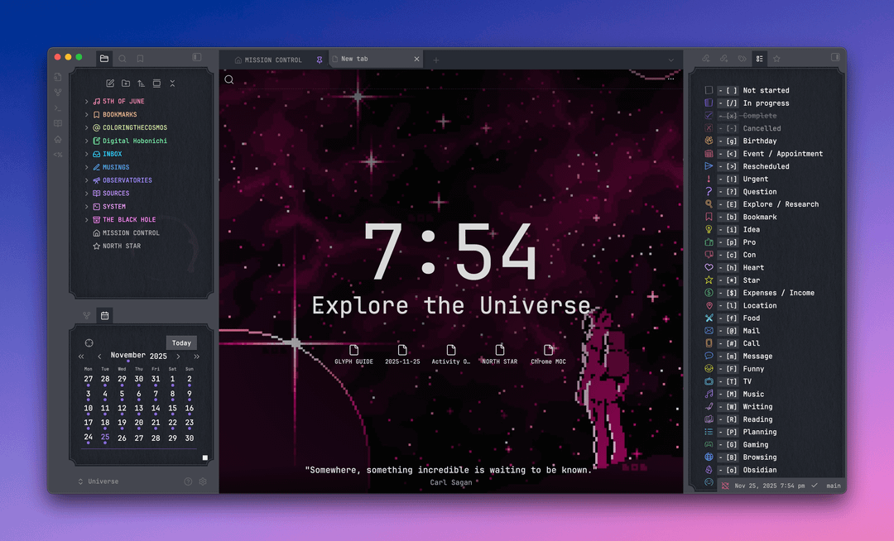
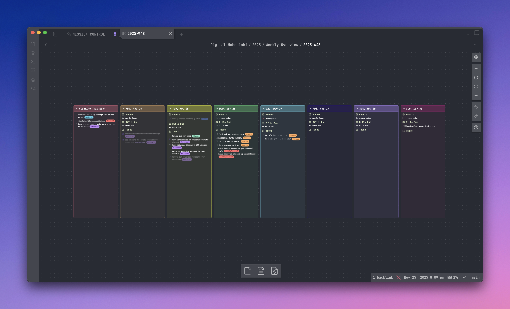

# 🌌 Welcome to My Universe


This vault is my sky — a living map of thoughts, memories, stories, and sparks of curiosity drifting through the dark. Every note is a star, every tag a constellation, every project a galaxy still expanding. Some ideas burn bright at the center of everything, others float softly at the edge, waiting to be discovered.

Here, I wander between nebulae, follow gentle trails of light, and build whole worlds out of stardust and intention.

This is my beautiful universe — tender, evolving, and endlessly my own.

Read on to learn how to explore my personal cosmos.

> We shall not cease from exploration, and the end of all our exploring will be to arrive where we started and know the place for the first time. <cite>T. S. Eliot</cite>

---
> ## ⋆｡°✩ Table of Contents ✩°｡⋆
> 01. [Visuals](https://github.com/aetrigg/obsidian-universe-public/tree/master?tab=readme-ov-file#-visuals-)
> 02. [About This Vault](https://github.com/aetrigg/obsidian-universe-public/tree/master?tab=readme-ov-file#-about-this-vault-)
> 03. [The Hitchhiker's Guide to My Universe](https://github.com/aetrigg/obsidian-universe-public/tree/master?tab=readme-ov-file#-the-hitchhikers-guide-to-my-universe-)
>	04. [Universal Glossary](https://github.com/aetrigg/obsidian-universe-public/tree/master?tab=readme-ov-file#-part-1-universal-glossary-)
>	05. [Coloring the Cosmos](https://github.com/aetrigg/obsidian-universe-public/tree/master?tab=readme-ov-file#-part-2-coloring-the-cosmos-lmao-)
>		01. [Universal Color Philosophy](https://github.com/aetrigg/obsidian-universe-public/tree/master?tab=readme-ov-file#-universal-color-philosophy-)
>		02. [Constellations](https://github.com/aetrigg/obsidian-universe-public/tree/master?tab=readme-ov-file#-constellations-)
>		03. [Star Charts](https://github.com/aetrigg/obsidian-universe-public/tree/master?tab=readme-ov-file#-star-charts-)
>	06. [Navigating the Nebulae](https://github.com/aetrigg/obsidian-universe-public/tree/master?tab=readme-ov-file#-part-3-navigating-the-nebulae-)
>		01. [The Celestial Architecture](https://github.com/aetrigg/obsidian-universe-public/tree/master?tab=readme-ov-file#-the-celestial-architecture-)
>		02. [The Digital Hobonichi Galaxy](https://github.com/aetrigg/obsidian-universe-public/tree/master?tab=readme-ov-file#-the-digital-hobonichi-galaxy-)
>		03. [The INBOX Nebula](https://github.com/aetrigg/obsidian-universe-public/tree/master?tab=readme-ov-file#-the-inbox-nebula-)
>		04. [The 5th of June Galaxy](https://github.com/aetrigg/obsidian-universe-public/tree/master?tab=readme-ov-file#-the-5th-of-june-galaxy-)
>		05. [The Coloring the Cosmos Galaxy](https://github.com/aetrigg/obsidian-universe-public/tree/master?tab=readme-ov-file#-the-coloring-the-cosmos-galaxy-)
>		06. [The OBSERVATORIES Nebula](https://github.com/aetrigg/obsidian-universe-public/tree/master?tab=readme-ov-file#-the-observatories-nebula-)
>		07. [The SYSTEM Nebula](https://github.com/aetrigg/obsidian-universe-public/tree/master?tab=readme-ov-file#-the-system-nebula-)
>	07. [Plugins Used](https://github.com/aetrigg/obsidian-universe-public/tree/master?tab=readme-ov-file#-part-4-plugins-used-)
>		01. [Core Plugins](https://github.com/aetrigg/obsidian-universe-public/tree/master?tab=readme-ov-file#-core-plugins-)
>		02. [Visualization & Interface Plugins](https://github.com/aetrigg/obsidian-universe-public/tree/master?tab=readme-ov-file#-visualization--interface-plugins-)
>		03. [Data & Query Plugins](https://github.com/aetrigg/obsidian-universe-public/tree/master?tab=readme-ov-file#-data--query-plugins-)
>		04. [Automation Plugins](https://github.com/aetrigg/obsidian-universe-public/tree/master?tab=readme-ov-file#-automation-plugins-)
>		05. [Integration Plugins](https://github.com/aetrigg/obsidian-universe-public/tree/master?tab=readme-ov-file#-integration-plugins-)
>		06. [Organization & Navigation Plugins](https://github.com/aetrigg/obsidian-universe-public/tree/master?tab=readme-ov-file#-organization--navigation-plugins-)
>		07. [Productivity & Tracking Plugins](https://github.com/aetrigg/obsidian-universe-public/tree/master?tab=readme-ov-file#-productivity--tracking-plugins-)
>		08. [Utility Plugins]([#utility-plugins](https://github.com/aetrigg/obsidian-universe-public/tree/master?tab=readme-ov-file#-utility-plugins-))
>		09. [Development & Writing Plugins]([#development--writing-plugins](https://github.com/aetrigg/obsidian-universe-public/tree/master?tab=readme-ov-file#-development--writing-plugins-))
>		10. [Setup Instructions](https://github.com/aetrigg/obsidian-universe-public/tree/master?tab=readme-ov-file#-setup-instructions-)
> 08. [A Gentle Warning from the Stars](https://github.com/aetrigg/obsidian-universe-public/tree/master?tab=readme-ov-file#-a-gentle-warning-from-the-stars-)
> 09. [Gratitude Across the Cosmos](https://github.com/aetrigg/obsidian-universe-public/tree/master?tab=readme-ov-file#-gratitude-across-the-cosmos-)
> 10. [Open Transmissions Welcome](https://github.com/aetrigg/obsidian-universe-public/tree/master?tab=readme-ov-file#-open-transmissions-welcome-)

---
## ⋆｡°✩ Visuals ✩°｡⋆





## ⋆｡°✩ About This Vault ✩°｡⋆
I created a showcase of my universe over on the Obsidian Members Group Discord, which is located [here](https://discord.com/channels/686053708261228577/1443067199202787481). I also created a [Reddit post](https://www.reddit.com/r/ObsidianMD/comments/1p6x88o/sharing_the_heart_of_my_universe_bonus_beautitab/) showcasing my home page and new tab styling. Both go further into depth about why I created my main universe in the first place. After multiple requests, I've created this public version of my universe for others to peruse. I will try my best to keep it up-to-date with my main universe, as it is still under construction and is constantly evolving! Please check the bottom of this file to see when I last updated this vault.

## ⋆｡°✩ The Hitchhiker's Guide to My Universe ✩°｡⋆

### ✩ Part 1: Universal Glossary ✩
_A compact dictionary of the celestial metaphors that shape my vault._

#### _**Universe**_
The entire vault; everything that exists among the stars.

#### _**Mission Control**_
The home page; my cosmic landing pad.

#### _**North Star**_
My cosmic README; a guide, orientation map, and reference for explorers.

#### _**Stars**_
Individual notes; sparks of thought, memory, or meaning.

#### _**Signals**_
Each individual time-logged entry within my daily stars using custom glyphs.

#### _**Glyphs**_
Custom doodle SVG checkboxes used to log activities and events within my daily stars.

#### _**Constellations**_
Tags tracing patterns between distant stars.

#### _**Star Clusters**_
Naturally forming groups of related notes within a nebula or galaxy.

#### _**Nuclear Star Clusters**_
MOCs; dense, radiant index notes anchoring a galaxy or nebula.

#### _**Galaxies**_
Major realms of my life; long-term projects or areas of interest.

#### _**Nebulae**_
Folders; dreamy clouds of potential where new stars form.

#### _**Planets**_
Important standalone structures (home page, guides) orbiting within galaxies.

#### _**Missions**_
Tasks; no matter how big or small, all missions live in the INBOX nebula.

#### _**Satellites**_
Orphan notes; lone stars drifting without links (for now).

#### _**Launchpads**_
Quick paths that let me navigate to key stars or galaxies.

#### _**Star Charts**_
Graph views; a visual constellation of all cosmic connections.

#### _**Observatories**_
Dashboards, views, & interfaces; places to watch or measure activity in my universe.

#### _**Black Hole**_
The archive; where old stars rest in quiet legend.

### ✩ Part 2: Coloring the Cosmos (lmao) ✩
_A guide to the color language that brings my universe to life. Each hue marks a different cosmic region, rhythm, or realm of my vault. Together, they help me navigate the stars at a glance._

_Also shameless plug for my insta & tiktok @coloringthecosmos lol_

#### ✧ _**Universal Color Philosophy**_ ✧
Color is the soft gravity of my universe — that way I instantly know where I am.

Each hue has a purpose:

- **Star Charts** use color to show the _origin_ of a note.
- **Nebulas** glow in the colors of my major vault regions.
- **Constellations** thread meaning across everything, tagging themes, emotions, and missions.

Together, they form the chromatic map of my cosmos.

#### ✧ _**Constellations**_ ✧
❤️ Red constellations in my Digital Hobonichi and missions help signify anything related to medical, fitness, health, or exercise.

🧡 Orange constellations in my Digital Hobonichi and missions help signify anything related to my home, including chores.

💚 Green constellations in my Digital Hobonichi and missions help signify anything related to finances, expenses, income and budgeting.

🩵 Teal constellations in my Digital Hobonichi and missions help signify anything related to friends and family.

💙 Blue constellations in my Digital Hobonichi and missions help signify anything related to my current career or dream career of being a writer.

💜 Purple constellations in my Digital Hobonichi and missions help signify anything personal or related to hobbies.

🩷 Pink constellations in my Digital Hobonichi and missions help signify anything related to my @coloringthecosmos account.

#### ✧ _**Star Charts**_ ✧
Please note that I am listing the ones I have set up in my main universe, and that some of the nebulae may not be available in the public universe. I may eventually add them, I may not, but I'll keep the star chart settings set up just in case.

❤️ Red stars in my star charts represent anything related to 5OJ, with varying degrees of redness for whether a note is apart of the series bible, drafts & revisions, or imported notes.

🧡 Orange stars in my star charts represent bookmarks in my BOOKMARKS nebula, with darker orange stars representing unsorted bookmarks.

💛 Yellow stars in my star charts represent my COLORINGTHECOSMOS galaxy.

💚 Green stars in my star charts represent anything financial within my universe.

🩵 Light blue stars in my star charts represent my INBOX nebula.

💙 Dark blue stars within my star charts represent my MUSINGS nebula.

💜 Purple stars within my star charts represent my SOURCES nebula.

💖 Lilac stars within my star charts represent my Digital Hobonichi galaxy.

🩷 Pink stars within my star charts signify anything in my SYSTEM nebula or related to my universe.

🖤 Black stars within my star charts signify anything that's in THE BLACK HOLE.

### ✩ Part 3: Navigating the Nebulae ✩

_A map of the major folder structures and what galaxies/projects live within them._

#### ✧ _**The Celestial Architecture**_ ✧

_A complete map of the universe's nebulae, planets, and star systems—showing how folders, files, and galaxies are organized across the cosmos._

```
.
├── 5OJ - Boy band novel series galaxy (W.I.P.)
│   ├── 5OJ Series Bible - Canonical documentation of characters, plot, and world-building
│   ├── Drafts & Revisions - Novel drafts and works in progress
│   └── Note Imports - Various notes imported from OneNote, Google Docs, and ChatGPT
├── COLORINGTHECOSMOS - Instagram/TikTok cozy coloring content galaxy (W.I.P.)
│   └── Color Palettes - Ohuhu marker color combos
├── Digital Hobonichi - Daily/weekly/monthly planning and logging galaxy
│   ├── 2025 - Organized by year
│   │   ├── 11-November - Daily stars for each month
│   │   ├── 12-December - Daily stars for each month
│   │   ├── Monthly Overview - Monthly summaries with visualizations and analytics
│   │   └── Weekly Overview - Weekly planning canvases with task columns
│   └── 2026 - Organized by year
│       ├── 01-January - Daily stars for each month
│       ├── Monthly Overview - Monthly summaries with visualizations and analytics
│       └── Weekly Overview - Weekly planning canvases with task columns
├── INBOX - Mission staging and organization nebula
│   ├── 00_MAIN.md - Aggregated view of all open missions from all sub-INBOXes
│   ├── 01_PERSONAL.md - Personal life missions
│   ├── 02_CHORES.md - Household missions
│   ├── 03_FINANCES.md - Financial missions and bill-related missions
│   ├── 04_WRITING.md - Writing projects including 5th of June
│   ├── 05_COLORING.md - Coloring the Cosmos content missions
│   ├── 06_FAMILY-FRIENDS.md - Social and family missions
│   ├── 07_RECURRING.md - Templates for recurring missions and scheduled events
│   ├── 08_UNIVERSE.md - Obsidian development and universe improvement missions
│   └── 99_UNSORTED.md - QuickAdd landing zone for missions needing routing
├── MISSION CONTROL.md - The home page and cosmic landing pad
├── NORTH STAR.md - Mini personal README guide with cosmic terminology & color codes
├── OBSERVATORIES - Dashboards and views of data living elsewhere in the universe
│   ├── Activity Observatory.md - Activity tracking dashboard generated using the Daily Activity plugin
│   ├── Coloring Book Observatory.base - Tracking collection and progress of coloring books
│   ├── Finances - Financial tracking and reporting
│   │   ├── Bills & Subscriptions Overview.md - Overview of recurring bills and subscriptions
│   │   ├── Expenses Log.md - Daily expense tracking
│   │   ├── Expenses Observatory.md - Expense analytics and insights
│   │   └── Wealth Flux Report.md - Financial flow visualization and analysis
│   └── Frequency Scanner.md - Scans all signals within a time period with filtering capabilities
├── README.md - Documentation for the public version of the universe
├── SYSTEM - Vault infrastructure and utilities nebula
│   ├── Launchpads - Quick links to frequently accessed stars using .bases card layouts
│   ├── SIGNAL GUIDE.md - Reference guide for custom checkbox glyphs
│   ├── _ai - Agent documentation and prompts
│   ├── _data - Data storage for bills, coloring books, TV shows, movies, etc.
│   ├── _media - Images, gifs, and banners
│   ├── _scripts - JSON files, Templater scripts, Datacore components, and custom JavaScript
│   ├── _snippets - HTML widgets and CSS snippets
│   └── _templates - Templates for daily, weekly, monthly, and yearly notes
└── THE BLACK HOLE - Archive folder for old and inactive stars
```

#### ✧ _**The Digital Hobonichi Galaxy**_ ✧

Daily/weekly/monthly planning and logging system based on the analog Hobonichi planner. Includes daily stars with rapid logging, weekly overviews with task columns, and monthly summaries with custom Datacore visualizations.

For complete documentation, see [GALAXIES_digital-hobonichi](SYSTEM/_ai/Agents/GALAXIES/GALAXIES_digital-hobonichi.md)

#### ✧ _**The INBOX Nebula**_ ✧

Mission staging and organization system with 10 sub-INBOXes categorized by life area and project type. Missions are captured, routed to appropriate sub-INBOXes, and then pulled into the weekly overview for execution.

For complete mission management protocols, see [MISSION_PROTOCOLS](SYSTEM/_ai/Agents/MISSION_PROTOCOLS.md)

#### ✧ _**The 5th of June Galaxy**_ ✧

Boy band novel series—a 10-year creative writing project originally developed in 2015, shelved in 2016, and returned to in 2025. Currently in modernization phase, updating the series from 2010s to 2020s contexts while organizing canon materials and series bible.

For complete documentation, see [GALAXIES_5th-of-june](SYSTEM/_ai/Agents/GALAXIES/GALAXIES_5th-of-june.md)

#### ✧ _**The Coloring the Cosmos Galaxy**_ ✧

Instagram/TikTok social media presence focused on cozy coloring content. Currently on hiatus while focusing on 5th of June and Obsidian galaxies. Contains marker color palettes and coloring book tracking.

For complete documentation, see [GALAXIES_coloring-the-cosmos](SYSTEM/_ai/Agents/GALAXIES/GALAXIES_coloring-the-cosmos.md)

#### ✧ _**The OBSERVATORIES Nebula**_ ✧

Dashboards and views that provide perspectives on data living elsewhere in the universe. Includes activity tracking, financial observatories, signal frequency scanners, and coloring book progress tracking.

For complete documentation, see [OBSERVATORIES](SYSTEM/_ai/Agents/OBSERVATORIES.md)

#### ✧ _**The SYSTEM Nebula**_ ✧

Vault infrastructure and utilities including templates, scripts, data storage, media assets, and agent documentation. This is the machinery room where all the cosmic systems are built and maintained.

### ✩ Part 4: Plugins Used ✩

#### ✧ _**Core Plugins**_ ✧

- [journals](https://github.com/srg-kostyrko/obsidian-journal) - Generates daily, weekly, and monthly notes into the correct nebulae; displays monthly calendar in lower-left corner
- [templater-obsidian](https://github.com/SilentVoid13/Templater) - Creates custom templates with complex scripts for dailies, weeklies, and monthlies
- [quickadd](https://github.com/chhoumann/quickadd) - Quickly adds new logs to daily stars from anywhere in the universe
- [obsidian-meta-bind-plugin](https://github.com/mProjectsCode/obsidian-meta-bind-plugin) - Adds habit tracking data from inputs/toggles/sliders to the frontmatter of dailies
- [obsidian-tasks-plugin](https://github.com/obsidian-tasks-group/obsidian-tasks) - Mission management system used in INBOX nebula

#### ✧ _**Visualization & Interface Plugins**_ ✧

- [beautitab](https://github.com/andrewmcgivery/obsidian-beautitab) - Creates custom New Tab appearance
- [home-tab](https://github.com/olrenso/obsidian-home-tab) - Adds search bar widget to Mission Control
- [homepage](https://github.com/mirnovov/obsidian-homepage) - Quick link in ribbon to take me back to Mission Control
- [callout-manager](https://github.com/eth-p/obsidian-callout-manager) - Creates custom callouts for daily log
- [obsidian-icon-folder](https://github.com/FlorianWoelki/obsidian-icon-folder) - Used for nebula icons and icons within stars/planets
- [obsidian-icon-shortcodes](https://github.com/aidenlx/obsidian-icon-shortcodes) - Planned future replacement for icon-folder integration
- [pexels-banner](https://github.com/Zachatoo/obsidian-pexels-banner) - Adds banners to particular stars/planets
- [contribution-graph](https://github.com/vran-dev/obsidian-contribution-graph) - Renders contribution graph visualizations
- [obsidian-contextual-typography](https://github.com/mgmeyers/obsidian-contextual-typography) - Typography enhancements and styling
- [obsidian-view-mode-by-frontmatter](https://github.com/bwydoogh/obsidian-view-mode-by-frontmatter) - Automatically sets view mode based on frontmatter

#### ✧ _**Data & Query Plugins**_ ✧

- [datacore](https://github.com/blacksmithgu/datacore) - Primary querying and React component development; actively replacing Dataview for performance optimization
- [dataview](https://github.com/blacksmithgu/obsidian-dataview) - Query and data aggregation; being phased out in favor of Datacore
- [obsidian-charts](https://github.com/phibr0/obsidian-charts) - Renders all charts in the universe

#### ✧ _**Automation Plugins**_ ✧

- [buttons](https://github.com/shabegom/buttons) - Creates interactive buttons for various actions
- [js-engine](https://github.com/mProjectsCode/obsidian-js-engine-plugin) - JavaScript execution engine for advanced scripting
- [markdown-attributes](https://github.com/ArthurHeitmann/obsidian-markdown-attributes) - Helps style custom navigation used in Mission Control and dailies/monthlies
- [nldates-obsidian](https://github.com/argenos/nldates-obsidian) - Allows shortcode to implement current time in daily logs
- [metaedit](https://github.com/chhoumann/MetaEdit) - Adds sleep tracking data to the frontmatter of older dailies

#### ✧ _**Integration Plugins**_ ✧

- [google-photos](https://github.com/alangrainger/obsidian-google-photos) - Imports photos from Google Photos into daily stars; [setup required*](#google-photos-1)
- [visual-crossing-weather](https://github.com/willasm/obsidian-visual-crossing-weather) - Renders high/low temps and daily weather conditions in dailies; [setup required*](#visual-crossing-weather-1)
- [obsidian-git](https://github.com/denolehov/obsidian-git) - Version control and backup

#### ✧ _**Organization & Navigation Plugins**_ ✧

- [folder-overview](https://github.com/til-schneider/obsidian-folder-overview) - Creates MOC lists for Nuclear Star Clusters
- [folders2graph](https://github.com/Ratibus11/folders2graph) - Links nebulae and sub-nebulae together within the star charts
- [sync-graph-settings](https://github.com/Xallt/sync-graph-settings) - Keeps consistency of colors between star charts
- [colored-tags-wrangler](https://github.com/code-of-chaos/obsidian-colored_tags_wrangler) - Colors the constellations to a specific color code
- [tag-wrangler](https://github.com/pjeby/tag-wrangler) - Adds additional functionality to constellation searching
- [multi-tag](https://github.com/fez-github/obsidian-multi-tag) - Allows adding a constellation to all stars/planets within a nebula
- [global-search-and-replace](https://github.com/MahmoudFawzyKhalil/obsidian-global-search-and-replace) - Global search and replace functionality across the vault

#### ✧ _**Productivity & Tracking Plugins**_ ✧

- [daily-activity](https://github.com/trydalch/obsidian-daily-activity) - Renders Activity Observatory
- [focus-time](https://github.com/gruckion/obsidian-focus-time) - Displays popout observatory of time spent in the universe; adds time tracker to status bar
- [obsidian-grandfather](https://github.com/noatpad/obsidian-grandfather) - Displays the time in the status bar (used in full-screen mode)

#### ✧ _**Utility Plugins**_ ✧

- [obsidian-style-settings](https://github.com/mgmeyers/obsidian-style-settings) - Further customization of theme settings and various CSS snippets
- [statusbar-organizer](https://github.com/Opisek/obsidian-statusbar-organizer) - Hides and reorders elements in the status bar
- [inline-spoilers](https://github.com/jhzn/obsidian-inline-spoilers) - Adds Discord-like syntax to messages to generate spoilers
- [garble-text](https://github.com/kurakart/garble-text) - Text obfuscation utility
- [reactive-notes](https://github.com/sotoplatero/obsidian-reactive-notes) - React component rendering; backup plugin in case Datacore fails

#### ✧ _**Development & Writing Plugins**_ ✧

- [ai-providers](https://github.com/TfTHacker/obsidian42-ai-providers) - AI integration for the universe; not actively using yet; [setup optional*](#ai-providers-1)
- [markwhen](https://github.com/kochrt/obsidian-markwhen) - Generates timelines for the 5OJ galaxy

#### ✧ _**Setup Instructions**_ ✧

##### [google-photos](https://github.com/alangrainger/obsidian-google-photos)

_Coming soon_

##### [visual-crossing-weather](https://github.com/willasm/obsidian-visual-crossing-weather)

_Coming soon_

##### [ai-providers](https://github.com/TfTHacker/obsidian42-ai-providers)

_Coming soon_

## ⋆｡°✩ A Gentle Warning from the Stars ✩°｡⋆

### ✩ Please Know ✩

This universe is alive and ever-changing—constellations shift, nebulae expand, and sometimes stars flicker with updates to Obsidian, plugins, or themes. While I tend to it with care, I cannot promise every star will shine perfectly at all times. If you find yourself lost in the cosmic dark, please [reach out](#open-transmissions-welcome). Also, I prioritize ***reading view*** over editing view, so all views are optimized for this.

### ✩ Not Optimized for Pocket Galaxies ✩

This universe was crafted for desktop exploration and may not translate well to mobile devices. Many of its celestial features and custom components were designed for a larger sky.

### ✩ Born from Collaboration with AI ✩

Much of this cosmos was shaped with AI as my co-pilot (despite my own constellation of web design skills). If you prefer purely human-crafted worlds, this universe may not call to you.

### ✩ Visual Content ✩

None of the photos, gifs, or banners used throughout this universe are mine. All copyright belongs to their respective owners.

### ✩ A Personal Cosmos, Not a Universal Template ✩

While you can step into this universe and explore it as-is, remember—it follows the unique rhythm of my own orbit. It's not a one-size-fits-all starter vault, but rather a window into how I've organized my celestial space. **I cannot be held responsible for any stardust lost along the way.** Keep your own universe backed up, and let mine inspire rather than replace.

### ✩ Navigate At Your Own Wonder ✩

By wandering into this universe, you accept that it's a deeply personal, intricate system—and you hold the compass for any journey you choose to take within it.

## ⋆｡°✩ Gratitude Across the Cosmos ✩°｡⋆

To those whose light helped shape my universe:

- **To everyone who asked for this vault to be shared** - Your enthusiasm became the gravity that pulled me to polish every star, even while the universe itself is still forming
- **@Weaverling**, **@ᵏᵒʳᵉᶠᵒˣ**, and **@bushidō** - Your own universes were the first constellations I followed, and your friendship and encouragement lit the way through this universe's evolution
- **[HOCA-1's Neon Homepage](https://github.com/HOCA-1/neon-homepage-vault)** - Your vision lit the path to my MISSION CONTROL
- **[John's Galaxy on the Web](https://notes.johnmavrick.com/Digital+Galaxy/Welcome+%F0%9F%8C%8C)** - For showing me that organization could be cosmic
- **[ElsaTam (@Kapirklaa)](https://github.com/ElsaTam/obsidian-fancy-a-story)** - For creating the Fancy-a-Story theme that brings visual magic to my universe
- **Kepano and the Obsidian team** - For crafting the telescope through which I see it all
- **The Obsidian community** - For filling the night sky with endless possibilities

## ⋆｡°✩ Open Transmissions Welcome ✩°｡⋆

#### ✧ _**Find Me Across the Cosmos**_ ✧

For questions, feedback, or to share your own cosmic journey inspired by this universe, you can reach me on Discord at **@hppandeli**.

I prefer questions and discussions in the [dedicated thread for my universe](https://discord.com/channels/686053708261228577/1443067199202787481) in the Obsidian Members Group Discord, where we can explore the stars together.

**Not comfortable with Discord?** You can also [open an issue on GitHub](https://github.com/aetrigg/obsidian-universe-public/issues). This is my first time maintaining a public repository, so I'm still finding my way—any tips or patience are greatly appreciated as I learn!

#### ✧ _**Buy Me a Coffee**_ ✧

I build and maintain this universe in my free time, pouring countless hours into crafting something beautiful and functional to share with the community. If this vault has inspired you or helped organize your own cosmos, consider [buying me a coffee](https://buymeacoffee.com/hppandeli) to fuel future star-building sessions!

_Last Updated: February 2nd, 2026_
