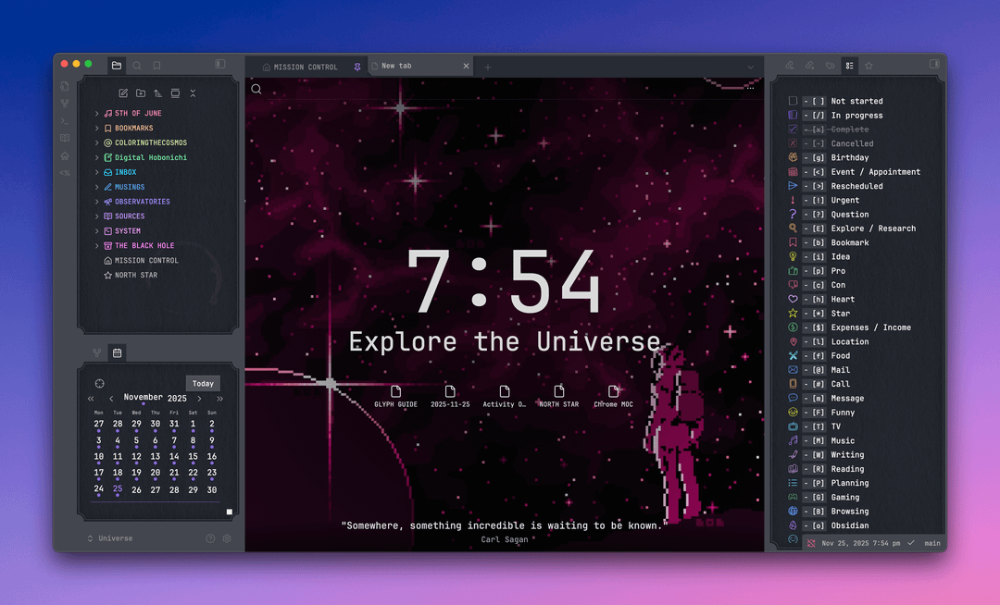
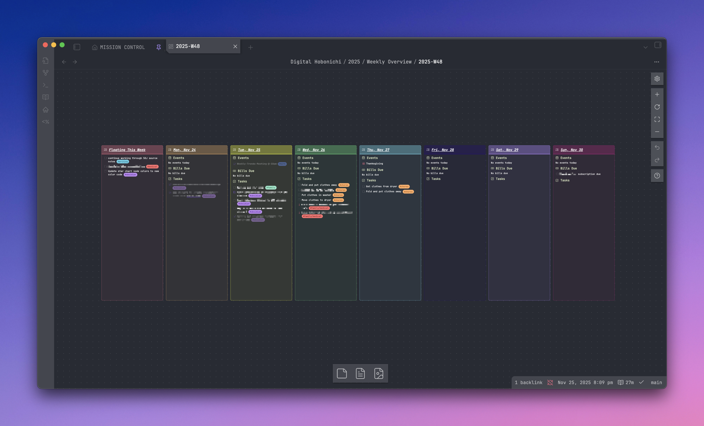

# 🌌 Welcome to My (Public) Universe

> A cosmic-themed Obsidian vault for life management, creative writing, and personal organization — originally shared on [Reddit](https://www.reddit.com/r/ObsidianMD/comments/1p6x88o/sharing_the_heart_of_my_universe_bonus_beautitab/) and the [Obsidian Members Group Discord](https://discord.com/channels/686053708261228577/1443067199202787481).

<p align="center">     </p>

---

## 🌟 Showcase

<div align="center"> <a href="./SYSTEM/_media/images/screenshots/homepage.gif">  </a> </div>

---

## 🗂️ Index

- [About](https://github.com/aetrigg/obsidian-universe-public?tab=readme-ov-file/#-about)
- [Features](https://github.com/aetrigg/obsidian-universe-public?tab=readme-ov-file/#-features)
- [Screenshots](https://github.com/aetrigg/obsidian-universe-public?tab=readme-ov-file/#-screenshots)
- [Getting Started](https://github.com/aetrigg/obsidian-universe-public?tab=readme-ov-file/#-getting-started)
- [Folder Structure](https://github.com/aetrigg/obsidian-universe-public?tab=readme-ov-file/#-folder-structure)
- [Cosmic Glossary](https://github.com/aetrigg/obsidian-universe-public?tab=readme-ov-file/#-cosmic-glossary)
- [Plugins](https://github.com/aetrigg/obsidian-universe-public?tab=readme-ov-file/#-plugins)
- [Disclaimers](https://github.com/aetrigg/obsidian-universe-public?tab=readme-ov-file/#-disclaimers)
- [Acknowledgments](https://github.com/aetrigg/obsidian-universe-public?tab=readme-ov-file/#-acknowledgements)
- [Contributions](https://github.com/aetrigg/obsidian-universe-public?tab=readme-ov-file/#-contributions)
- [Contact & Support](https://github.com/aetrigg/obsidian-universe-public?tab=readme-ov-file#-contact--support)

---

## ✨ About

After multiple requests from the community, I created this public version for others to peruse. I'll do my best to keep it up-to-date with my main universe, as it's still under construction and constantly evolving!

> [!NOTE] 
> This vault started as a personal life management experiment and turned into an entire cosmic system ✨

---

## ✨ Features

- 🌠 **Cosmic Metaphor System** — Notes are stars, tags are constellations, folders are nebulae, and projects are galaxies
- 📓 **Digital Hobonichi** — Daily/weekly/monthly planning system based on the analog Hobonichi planner
- ✅ **Mission Management** — Task system with 10 categorized sub-INBOXes across life areas
- 📊 **Observatories** — Custom dashboards for activity tracking, finances, signal frequency scanning, and more
- 🎨 **Color-Coded Organization** — Unified color language across tags, graph view, and folder regions
- ✍️ **Creative Writing Galaxy** — Series bible, drafts, and world-building for the _5th of June_ boy band novel series
- 🖼️ **ColoringtheCosmos** — Galaxy dedicated to Instagram/TikTok cozy coloring content (@coloringthecosmos)

---

## 📸 Screenshots

### New Tab Setup
<div align="center"> <a href="./SYSTEM/_media/images/screenshots/new-tab-setup.png">  </a> </div>

### Daily Star
<div align="center"> <a href="./SYSTEM/_media/images/screenshots/daily-star.png">  </a> </div>

### Weekly Overview
<div align="center"> <a href="./SYSTEM/_media/images/screenshots/redacted-weekly-overview.png">  </a> </div>

### Monthly Overview
<div align="center"> <a href="./SYSTEM/_media/images/screenshots/monthly-overview.png">  </a> </div>

### Frequency Scanner
<div align="center"> <a href="./SYSTEM/_media/images/screenshots/frequency-scanner.png">  </a> </div>

### Bills & Subscriptions
<div align="center"> <a href="./SYSTEM/_media/images/screenshots/bills-subscriptions-overview.png">  </a> </div>

---

## 🚀 Getting Started

1. Clone the repository:
    
    ```
    git clone https://github.com/aetrigg/obsidian-universe-public.git
    ```
    
    Or download as ZIP.
2. Open [Obsidian](https://obsidian.md/).
3. Select **"Open folder as vault"** and choose the downloaded folder.
4. Open **HITCHHIKER'S GUIDE.md** for a full guided tour of the vault's cosmic terminology, color system, folder structure, and plugins.

> [!WARNING] 
> This vault is optimized for **reading view** — all views are designed with reading mode in mind.

> [!TIP] 
> New to the universe? Start with **MISSION CONTROL.md** (the home page) and explore from there. The **NORTH STAR.md** sidebar cheat sheet is also a great quick reference.

---

## 📂 Folder Structure

```
.
├── 5OJ/                    — Boy band novel series galaxy (W.I.P.)
│   ├── 5OJ Series Bible/       — Characters, plot, and world-building
│   ├── Drafts & Revisions/     — Novel drafts and works in progress
│   └── Note Imports/            — Notes from OneNote, Google Docs, ChatGPT
├── COLORINGTHECOSMOS/      — Instagram/TikTok cozy coloring content galaxy
│   └── Color Palettes/         — Ohuhu marker color combos
├── Digital Hobonichi/      — Daily/weekly/monthly planning galaxy
│   └── [Year]/
│       ├── [Month]/             — Daily stars
│       ├── Monthly Overview/    — Monthly summaries with visualizations
│       └── Weekly Overview/     — Weekly planning canvases
├── INBOX/                  — Mission staging and organization nebula
│   ├── 00_MAIN.md               — Aggregated view of all open missions
│   ├── 01_PERSONAL.md           — Personal life missions
│   ├── 02_CHORES.md             — Household missions
│   ├── 03_FINANCES.md           — Financial missions
│   ├── 04_WRITING.md            — Writing projects
│   ├── 05_COLORING.md           — CTC content missions
│   ├── 06_FAMILY-FRIENDS.md     — Social and family missions
│   ├── 07_RECURRING.md          — Recurring missions and events
│   ├── 08_UNIVERSE.md           — Vault development missions
│   └── 99_UNSORTED.md           — QuickAdd landing zone
├── OBSERVATORIES/          — Dashboards and data views
│   ├── Finances/                — Bills, expenses, and financial analytics
│   ├── Activity Observatory.md  — Generated using the Daily Activity plugin
│   ├── Coloring Book Observatory.base
│   └── Frequency Scanner.md     — Quickly view previous signals
├── SYSTEM/                 — Vault infrastructure and utilities
│   ├── Launchpads/              — Quick navigation cards
│   ├── _ai/                     — Agent documentation and prompts
│   ├── _data/                   — Data storage (bills, shows, etc.)
│   ├── _media/                  — Images, gifs, banners
│   ├── _scripts/                — Templater scripts, JS, Datacore components
│   ├── _snippets/               — CSS snippets and HTML widgets
│   └── _templates/              — Templates for dailies, weeklies, monthlies
├── THE BLACK HOLE/         — Archive for old and inactive stars
├── MISSION CONTROL.md      — Home page and cosmic landing pad
├── HITCHHIKER'S GUIDE.md  — Full guided tour and reference guide
└── NORTH STAR.md           — Quick-reference sidebar cheat sheet
```

---

## 🏷️ Cosmic Glossary

|Term|Meaning|
|---|---|
|**Universe**|The entire vault|
|**Stars**|Individual notes|
|**Constellations**|Tags|
|**Nebulae**|Folders|
|**Galaxies**|Major projects or life areas|
|**Missions**|Tasks|
|**Mission Control**|Home page|
|**North Star**|Quick-reference sidebar cheat sheet|
|**Hitchhiker's Guide**|In-vault deep-dive tour and reference guide|
|**Observatories**|Dashboards and data views|
|**Star Charts**|Graph views|
|**Signals**|Time-logged entries in daily stars|
|**Glyphs**|Custom SVG checkbox icons|
|**Nuclear Star Clusters**|MOCs (Maps of Content)|
|**Satellites**|Orphan notes|
|**Launchpads**|Quick navigation paths|
|**The Black Hole**|Archive|

---

## 🔌 Plugins

<details> <summary><b>Core Plugins</b></summary>

- [Journals](https://github.com/srg-kostyrko/obsidian-journal) — Daily, weekly, and monthly note generation
- [Templater](https://github.com/SilentVoid13/Templater) — Custom templates with complex scripts
- [QuickAdd](https://github.com/chhoumann/quickadd) — Quick logging from anywhere in the vault
- [Meta Bind](https://github.com/mProjectsCode/obsidian-meta-bind-plugin) — Habit tracking inputs in dailies
- [Tasks](https://github.com/obsidian-tasks-group/obsidian-tasks) — Mission management system

</details> <details> <summary><b>Visualization & Interface</b></summary>

- [Beautitab](https://github.com/andrewmcgivery/obsidian-beautitab) — Custom new tab appearance
- [Home Tab](https://github.com/olrenso/obsidian-home-tab) — Search bar widget for Mission Control
- [Homepage](https://github.com/mirnovov/obsidian-homepage) — Quick link to Mission Control
- [Callout Manager](https://github.com/eth-p/obsidian-callout-manager) — Custom callouts for daily logs
- [Icon Folder](https://github.com/FlorianWoelki/obsidian-icon-folder) — Nebula and star icons
- [Icon Shortcodes](https://github.com/aidenlx/obsidian-icon-shortcodes) — Planned icon-folder replacement
- [Pexels Banner](https://github.com/Zachatoo/obsidian-pexels-banner) — Note banners
- [Contribution Graph](https://github.com/vran-dev/obsidian-contribution-graph) — Contribution graph visualizations
- [Contextual Typography](https://github.com/mgmeyers/obsidian-contextual-typography) — Typography enhancements
- [View Mode by Frontmatter](https://github.com/bwydoogh/obsidian-view-mode-by-frontmatter) — Auto view mode switching

</details> <details> <summary><b>Data & Query</b></summary>

- [Datacore](https://github.com/blacksmithgu/datacore) — Primary querying and React component rendering
- [Dataview](https://github.com/blacksmithgu/obsidian-dataview) — Query and data aggregation (being phased out)
- [Charts](https://github.com/phibr0/obsidian-charts) — Chart rendering

</details> <details> <summary><b>Automation</b></summary>

- [Buttons](https://github.com/shabegom/buttons) — Interactive action buttons
- [JS Engine](https://github.com/mProjectsCode/obsidian-js-engine-plugin) — JavaScript execution engine
- [Markdown Attributes](https://github.com/ArthurHeitmann/obsidian-markdown-attributes) — Custom navigation styling
- [Natural Language Dates](https://github.com/argenos/nldates-obsidian) — Natural language dates for daily logs
- [MetaEdit](https://github.com/chhoumann/MetaEdit) — Frontmatter editing for sleep tracking

</details> <details> <summary><b>Integration</b></summary>

- [Google Photos](https://github.com/alangrainger/obsidian-google-photos) — Google Photos in daily stars _(setup required)_
- [Visual Crossing Weather](https://github.com/willasm/obsidian-visual-crossing-weather) — Daily weather data _(setup required)_
- [Obsidian Git](https://github.com/denolehov/obsidian-git) — Version control and backup

</details> <details> <summary><b>Organization & Navigation</b></summary>

- [Folder Overview](https://github.com/til-schneider/obsidian-folder-overview) — MOC lists for Nuclear Star Clusters
- [Folders2Graph](https://github.com/Ratibus11/folders2graph) — Links nebulae in star charts
- [Sync Graph Settings](https://github.com/Xallt/sync-graph-settings) — Consistent star chart colors
- [Colored Tags Wrangler](https://github.com/code-of-chaos/obsidian-colored_tags_wrangler) — Color-coded constellations
- [Tag Wrangler](https://github.com/pjeby/tag-wrangler) — Advanced constellation searching
- [Multi Tag](https://github.com/fez-github/obsidian-multi-tag) — Bulk constellation tagging
- [Global Search and Replace](https://github.com/MahmoudFawzyKhalil/obsidian-global-search-and-replace) — Global search and replace

</details> <details> <summary><b>Productivity & Tracking</b></summary>

- [Daily Activity](https://github.com/trydalch/obsidian-daily-activity) — Activity Observatory rendering
- [Focus Time](https://github.com/gruckion/obsidian-focus-time) — Time tracking for universe sessions
- [Grandfather](https://github.com/noatpad/obsidian-grandfather) — Status bar clock

</details> <details> <summary><b>Utility</b></summary>

- [Style Settings](https://github.com/mgmeyers/obsidian-style-settings) — Theme and CSS customization
- [Statusbar Organizer](https://github.com/Opisek/obsidian-statusbar-organizer) — Status bar management
- [Inline Spoilers](https://github.com/jhzn/obsidian-inline-spoilers) — Spoiler syntax
- [Garble Text](https://github.com/kurakart/garble-text) — Text obfuscation
- [Reactive Notes](https://github.com/sotoplatero/obsidian-reactive-notes) — React component rendering (Datacore backup)

</details> <details> <summary><b>Development & Writing</b></summary>

- [AI Providers](https://github.com/TfTHacker/obsidian42-ai-providers) — AI integration _(setup optional)_
- [Markwhen](https://github.com/kochrt/obsidian-markwhen) — Timeline generation for 5OJ galaxy

</details>

> [!NOTE]
> Some plugins require external API keys or additional setup (marked above). Check each plugin's documentation for details.

---

## ⚠️ Disclaimers

> [!CAUTION] 
> **This is a personal system, not a starter template.** It was built for my own workflow and may not suit everyone out of the box. Use it as inspiration, not a drop-in replacement.

- **Desktop only** — Many features and custom components were designed for desktop and may not work on mobile.
- **Reading view optimized** — All views are designed for reading mode over editing mode.
- **AI-assisted** — Much of this vault was shaped with AI as co-pilot (alongside my own web design background).
- **Visual content** — Photos, gifs, and banners used throughout are not mine. All copyright belongs to their respective owners.
- **Living system** — Constellations shift, nebulae expand, and plugins update. I can't guarantee everything will work perfectly at all times.
- **Use at your own risk** — I cannot be held responsible for any stardust lost along the way. Keep your own vault backed up!

> [!IMPORTANT] 
> If you notice something broken or unclear, feel free to [open an issue](https://github.com/aetrigg/obsidian-universe-public/issues) — this is my first public repo, so tips and patience are appreciated!

---

## 🙏 Acknowledgments

- **Everyone who asked for this vault to be shared** — Your enthusiasm pulled me to polish every star
- **@Weaverling**, **@ᵏᵒʳᵉᶠᵒˣ**, and **@bushidō** — Your own universes were the first constellations I followed
- **[HOCA-1's Neon Homepage](https://github.com/HOCA-1/neon-homepage-vault)** — Lit the path to Mission Control
- **[John's Galaxy on the Web](https://notes.johnmavrick.com/Digital+Galaxy/Welcome+%F0%9F%8C%8C)** — Showed me organization could be cosmic
- **[ElsaTam (@Kapirklaa)](https://github.com/ElsaTam/obsidian-fancy-a-story)** — Creator of the Fancy-a-Story theme
- **Kepano and the Obsidian team** — For crafting the telescope through which I see it all
- **The Obsidian community** — For filling the night sky with endless possibilities

---

## 🤝 Contributions

This is a personal vault, but I'm always open to ideas, suggestions, and feedback! If you have thoughts on how to improve the system or spot something that could work better, feel free to:

- [Open an issue](https://github.com/aetrigg/obsidian-universe-public/issues) with your suggestion or bug report
- Fork the repo and submit a pull request
- Drop a message in the [dedicated Discord thread](https://discord.com/channels/686053708261228577/1443067199202787481)

> [!NOTE] 
> This is my first public repo, so I'm learning as I go — patience and tips are very much appreciated!

---
## 📬 Contact & Support

- **Discord**: @hppandeli — I prefer questions in the [dedicated thread](https://discord.com/channels/686053708261228577/1443067199202787481) in the Obsidian Members Group Discord
- **GitHub**: [Open an issue](https://github.com/aetrigg/obsidian-universe-public/issues)
- **Buy Me a Coffee** to fuel future space explorations!
<p align="center"> <a href="https://buymeacoffee.com/hppandeli" target="_blank">  </a> </p>

> Thank you for your support and encouragement ✨

---

_Last updated: March 13th, 2026_
